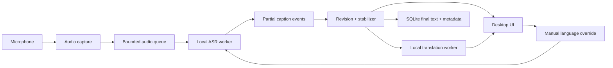

# Lingua Architecture

## 1. Architecture purpose

This document defines a small, local-first architecture for Lingua. It supports a working real-time application and reproducible experimentation without pretending that every one of the up to 99 ASR model candidates is a production-quality language.

Canonical product requirements live in `PRD.md`. Quick non-negotiable decisions live in `ARCHITECTURE-ESSETIALS.md`.

## 2. System boundaries

### Inside Lingua

- Microphone capture and resampling.
- Bounded chunk scheduling.
- Local ASR inference and language evidence.
- Caption revision, stabilization, and overlap de-duplication.
- Optional local stable-segment translation.
- Desktop UI, local session metadata, evaluation tooling, and experiment records.

### Outside Lingua

- Downloading approved open-source model artefacts is an explicit setup action, not runtime audio processing.
- Legal dataset acquisition and consent-managed user studies happen through documented procedures.
- No hosted ASR, hosted audio processing, remote analytics, or remote audio backup is part of product architecture.

## 3. Technology stack

| Layer | Initial choice | Reason |
| --- | --- | --- |
| Language/runtime | Python 3.11+ | Strong local audio and ML ecosystem; one runtime for application and experiments. |
| Desktop UI | PySide6 | Native local application with accessible widgets and no required web server. |
| Audio capture | `sounddevice` plus NumPy | Direct microphone stream and lightweight sample buffering. |
| ASR baseline runtime | `faster-whisper` with locally stored multilingual Whisper-compatible weights | Local inference and streaming-friendly model sizes. |
| Fine-tuning/experiments | PyTorch, Transformers, Datasets, Evaluate | Reproducible Indonesian ASR training and analysis. |
| Translation runtime | Local CTranslate2-compatible NLLB-class model, only for stable text | Separate worker prevents translation from delaying ASR. |
| Local persistence | SQLite through Python standard library | Small, inspectable storage for settings, final segments, and run metadata. |
| Tests | `unittest` initially; add `pytest` only when fixtures justify it | Keeps scaffold executable without a test framework dependency. |
| Formatting/linting | Ruff and formatter configuration added with first executable feature | Avoids fake tooling before code exists. |

Model packages and weights are optional extras, not committed repository files. Exact versions must be pinned when an executable milestone introduces them.

## 4. Runtime topology



The UI process owns session state. ASR and translation execute in isolated background workers or tasks. They exchange typed domain events; neither is allowed to call UI widgets directly.

## 5. Data flow and backpressure

1. Audio capture receives device samples, normalizes them to configured sample rate, and tags frames with monotonic sequence/time information.
2. Chunk scheduler builds short overlapping windows. Initial chunk and overlap values are configuration, not performance claims.
3. Audio queue has a fixed maximum length. When ASR cannot keep up, it drops oldest unprocessed partial work and emits a degraded-performance event. It never blocks capture indefinitely.
4. ASR returns a `CaptionHypothesis` containing interval, text, local language evidence, and partial/stable state.
5. Stabilizer compares revisions for the same time span, de-duplicates overlap, and promotes only sufficiently settled text to `CaptionSegment`.
6. Stable segments are persisted as text and metadata. Partial text and raw audio remain memory-only by default.
7. Translation worker receives stable source text. It returns a translation attached to the immutable source segment or a typed unavailable/error state.

Fresh caption text is more valuable than processing audio that is already too old to be useful live. This does not mean dropped audio is acceptable silently: the UI must expose degraded state and evaluation must report it.

## 6. Domain data models

Application models start in `src/lingua/domain/models.py`. They intentionally contain no audio arrays, model objects, database connections, or UI references.

| Model | Responsibility | Persisted? |
| --- | --- | --- |
| `LanguageProfile` | Candidate/evaluation/supported/restricted ASR and translation status. | Yes, catalogue/configuration. |
| `AudioFrame` | In-memory capture metadata for a short frame. Raw samples are transient. | No by default. |
| `AudioChunk` | In-memory ASR interval referring to one or more transient frames. | No. |
| `CaptionHypothesis` | Revisable local ASR output for an interval. | No by default. |
| `CaptionSegment` | Stable or final source transcript and optional translation link. | Yes. |
| `SessionRecord` | Session lifecycle, selected output, timing, and errors. | Yes, without raw audio. |

### SQLite schema, first milestone

```text
sessions(
  id TEXT PRIMARY KEY,
  started_at TEXT NOT NULL,
  ended_at TEXT,
  output_language TEXT NOT NULL,
  state TEXT NOT NULL,
  model_id TEXT NOT NULL,
  mean_caption_latency_ms REAL,
  degraded_reason TEXT
)

caption_segments(
  id TEXT PRIMARY KEY,
  session_id TEXT NOT NULL REFERENCES sessions(id),
  sequence INTEGER NOT NULL,
  start_ms INTEGER NOT NULL,
  end_ms INTEGER NOT NULL,
  source_language TEXT,
  source_text TEXT NOT NULL,
  translation_text TEXT,
  state TEXT NOT NULL,
  UNIQUE(session_id, sequence)
)

language_profiles(
  tag TEXT PRIMARY KEY,
  display_name TEXT NOT NULL,
  asr_status TEXT NOT NULL,
  translation_status TEXT NOT NULL,
  evidence_note TEXT NOT NULL,
  evaluated_at TEXT
)
```

No table stores audio blobs, speaker identity, cloud tokens, or unredacted participant feedback.

## 7. Interfaces and ownership

```python
class AudioSource(Protocol):
    def frames(self) -> Iterator[AudioFrame]: ...

class AsrEngine(Protocol):
    def transcribe(self, chunk: AudioChunk, language_hint: str | None) -> CaptionHypothesis: ...

class Translator(Protocol):
    def translate(self, source_text: str, source_language: str, target_language: str) -> str: ...

class SessionRepository(Protocol):
    def save_final_segment(self, segment: CaptionSegment) -> None: ...
```

Ports belong in `src/lingua/ports/`. Concrete local adapters belong in `src/lingua/infrastructure/`. Application orchestration belongs in `src/lingua/application/`. UI owns presentation only. This separation prevents a UI callback from quietly becoming a model runtime or persistence layer.

## 8. Language catalogue design

The language catalogue is configuration and evidence, not a static claim copied from a model card.

- `configs/language_catalog.example.json` demonstrates format without claiming a complete supported list.
- ASR candidate count can reach 99 only if selected local model exposes those labels.
- `asr_status` and `translation_status` are separate fields.
- Manual override must use a catalogue tag, not arbitrary free text.
- New supported language needs a recorded evaluation artifact and a user scenario.
- A model/runtime update triggers regression evaluation for enabled languages; it does not inherit old Supported status automatically.

## 9. Reliability, privacy, and recovery

| Failure | Design response |
| --- | --- |
| Missing model | Block session start; explain local setup requirement. |
| Unsupported sample rate/device loss | Stop safely, keep finalized text, show recovery action. |
| Queue saturation | Drop stale partial work, retain UI responsiveness, record degradation. |
| ASR worker error | Surface error, preserve final segments, allow new session. |
| Translation worker error | Keep original stable transcript visible; mark translation unavailable. |
| Low language confidence | Show uncertainty and enable override. |
| Storage unavailable | Continue live in memory; warn that final history cannot persist. |

Audio is processed locally and held only for inference buffers unless user later explicitly opts into recording. Any future recording feature requires a separate PRD and consent design; it is not covered by this architecture.

## 10. Evaluation architecture

Experiments must be runnable without the UI and produce provenance-rich outputs.

```text
data/               data cards, manifests, and ignored local data roots
configs/            versioned model and evaluation settings
scripts/            explicit commands for data preparation, training, and evaluation
experiments/        code only; generated runs are ignored
reports/            curated, anonymized aggregate results with provenance
```

Each run records model/runtime version, decoding options, dataset version and split, language, hardware, audio configuration, command, timestamp, WER/CER as applicable, latency/RTF, sample errors, and output path. Training/validation/test partition must remain separate. Indonesian baseline and fine-tuned variants must share a held-out evaluation protocol.

## 11. Test strategy

| Layer | Tests |
| --- | --- |
| Domain | Validation, state transitions, immutable stable text, language-status rules. |
| Application | Queue overload policy, manual override precedence, translation isolation. |
| Adapters | Mocked microphone, local ASR contract, SQLite migrations/repository. |
| End-to-end | Real microphone session with named hardware and recorded timings. |
| Evaluation | Fixed held-out samples, noise/pace/device conditions, qualitative error review. |
| User study | Consent-aware task completion and anonymized feedback tied to observed technical behavior. |

## 12. Deliberate exclusions and anti-overengineering decisions

- No microservices, web API, message broker, cloud queue, or distributed database. One local application is enough.
- No automatic language-identification model in addition to ASR language evidence for first milestone.
- No speaker diarization, speaker biometrics, recording library, or analytics dashboard.
- No custom multilingual fine-tuning programme for 99 languages. Research focus remains Indonesian ASR.
- No translation of partial captions and no database persistence for every revision.

## 13. Open decisions, triggered only by evidence

| Decision | Evidence needed |
| --- | --- |
| Exact Whisper-compatible model size/runtime | Measured WER, latency/RTF, memory, and hardware fit. |
| Exact chunk duration and overlap | Boundary-word error and responsiveness tests. |
| Supported language list | Legal data, use case, per-language measurements, local runtime test. |
| Translation model/pairs | Local memory/latency measurement and output evaluation. |
| Transcript history retention | User need, privacy review, and storage behavior test. |

## 14. Architecture review: likely breakpoints

Most likely failures are slower-than-real-time inference, model memory pressure, audio-device instability, overlap duplication, code switching, non-Latin-script metric mistakes, unsupported translation pairs, and unrepresentative language evaluation. Architecture mitigates these with bounded queues, typed status, transcript-first behavior, manual override, language-specific metric documentation, and explicit restriction states. It does not claim these mitigations solve every failure before measurement.
