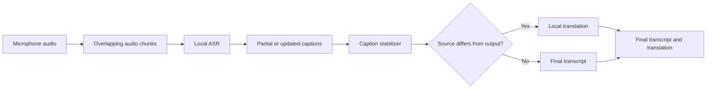

<div align="center">


# Lingua

### Local Indonesian-English live captions and translation

A course project being built to help English-comfortable listeners follow bilingual Indonesian-English lectures, presentations, and discussions.

[Project context](./docs/PROJECT_CONTEXT.md) · [Collaboration guide](./docs/COLLABORATION.md) · [Source of truth](./docs/SOURCE_OF_TRUTH.md)

</div>

> **Project status: In progress.** The repository currently contains the agreed product scope, collaboration guidance, and a project icon. Application code, UI screenshots, evaluation charts, datasets, model weights, and measured results are not available yet.

## Overview

Lingua is planned as a local, real-time Indonesian-English speech recognition and translation application for bilingual listening contexts. It will capture microphone audio continuously, show partial or updated captions while speech continues, indicate the likely source language, and translate only stable caption segments when the selected output language differs.

The project serves both Deep Learning and Speech Recognition final-project requirements. Its primary research contribution is Indonesian ASR fine-tuning, evaluated fairly against a pretrained baseline. Its product contribution is a local, responsive microphone workflow rather than post-recording transcription or a hosted speech-recognition API.

## Planned Product Experience

- Select Indonesian or English as the output language.
- Start a local microphone session with continuous audio capture.
- Read partial or updated captions before the speaker finishes.
- Review source-language evidence, or override an uncertain language state.
- Receive translation only after a caption segment stabilizes.
- Stop the session and review the final transcript, translation, and latency summary.

## Planned Workflow

This flow is the agreed implementation target, not a claim that the application is already running.



## Technical Direction

| Area | Current plan |
| --- | --- |
| Speech recognition | A locally downloaded open-source multilingual Whisper model or compatible local runtime |
| Deep Learning contribution | Fine-tune Indonesian ASR and compare it with a pretrained baseline on separate held-out data |
| Translation | A local open-source model, such as NLLB, used only for stable segments |
| Real-time behavior | Short overlapping microphone chunks, a bounded background queue, and caption updates that do not wait for translation |
| Languages | Indonesian and English |
| Evaluation | Word Error Rate (WER), latency or real-time factor, qualitative error analysis, and consent-aware target-user feedback |

These are project decisions documented in [PROJECT_CONTEXT.md](./docs/PROJECT_CONTEXT.md). They are not implementation or performance claims.

## Repository Structure

```text
.
├── assets/
│   └── lingua-icon.svg          # Project icon
├── data/
│   └── README.md                # Data-handling notes
├── docs/
│   ├── AI_USAGE_LOG_TEMPLATE.md
│   ├── COLLABORATION.md
│   ├── PROJECT_CONTEXT.md
│   └── SOURCE_OF_TRUTH.md
├── models/
│   └── .gitkeep
├── AGENTS.md                    # Repository workflow and contribution rules
└── README.md
```

## Run Locally

Not available yet. The repository does not currently include application source code, a dependency manifest, or a verified startup command. Setup instructions will be added together with the first reproducible local application milestone.

## Testing and Validation

No automated tests, application screenshots, model benchmarks, or measured user-study results are available yet. Future validation must use real, reproducible evidence and will record:

- pretrained and fine-tuned ASR WER on held-out data;
- latency, response time, or real-time factor with hardware and chunk settings;
- errors involving noise, speed, accents, code switching, technical terms, names, and microphone quality;
- at least five consent-aware target-user sessions with anonymized feedback.

## Current Limitations

- No working microphone application or user interface has been committed.
- No local ASR or translation runtime has been integrated.
- No legal dataset preparation record, trained checkpoint, or model comparison is available.
- No measured accuracy, latency, or user-feedback result can be claimed.

## Next Milestones

1. Add a reproducible local application foundation with continuous microphone capture.
2. Integrate local ASR with visible partial or updated captions.
3. Add stable-segment local translation and source-language controls.
4. Document legal data preparation, baseline evaluation, and Indonesian ASR fine-tuning.
5. Run reproducible performance tests and consent-aware target-user sessions.

## Data, Attribution, and License

No dataset, model weight, checkpoint, raw recording, or participant feedback is committed to this repository. The planned evaluation must document each dataset's license, source, split, model/runtime settings, hardware, command, and output location before results are trusted.

See [SOURCE_OF_TRUTH.md](./docs/SOURCE_OF_TRUTH.md) for the official-course criteria locations and [COLLABORATION.md](./docs/COLLABORATION.md) for the repository content policy.
